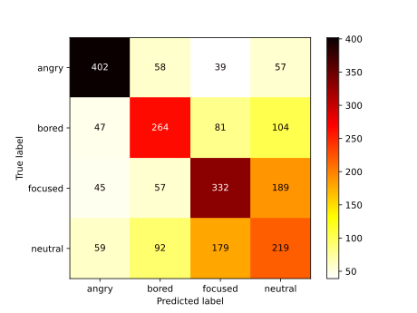
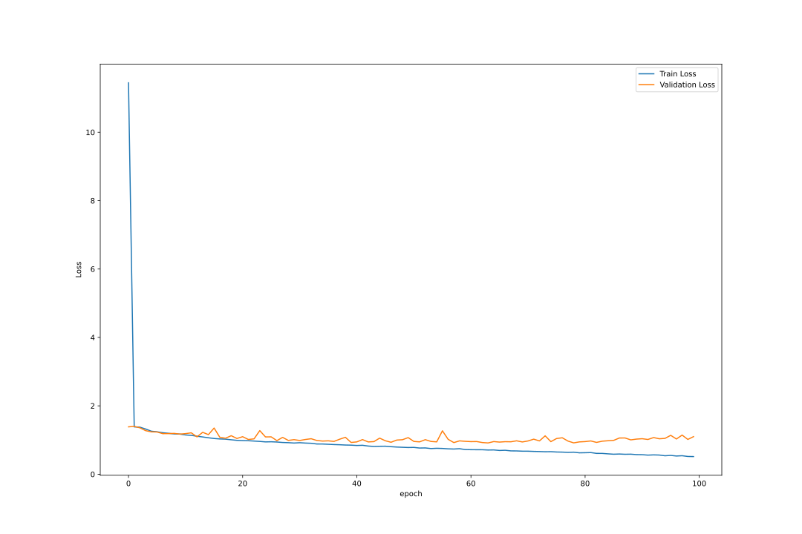
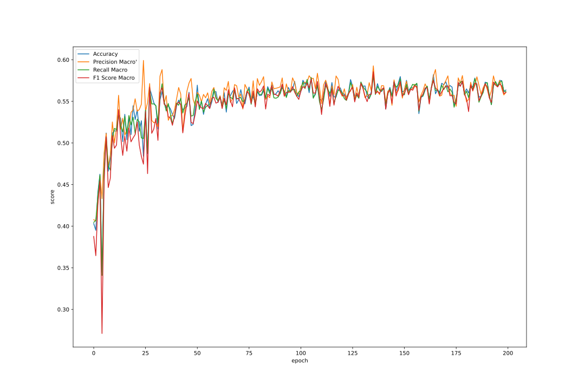
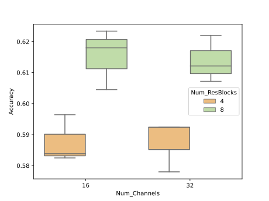
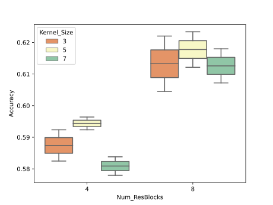

# A.I.ducation Analytics

## Project Overview

This project, undertaken as part of COMP 6721 Applied Artificial Intelligence, explores the realm of facial expression recognition. The primary objective is to develop an understanding of emotions depicted in facial images and create a robust model for emotion recognition. The project focuses on preprocessing a comprehensive dataset, combining FER2013 and FER+, and enhancing it to facilitate accurate training and evaluation of emotion recognition models.

## Data Pre-Processing

### Dataset

#### Facial Expression Recognition (FER) 2013 Dataset

The primary dataset utilized is the FER2013 dataset, a pivotal resource in facial emotion recognition. Comprising grayscale images measuring $48 \times 48$ pixels, FER2013 contains 32,298 samples categorized into seven emotions: Angry, Disgust, Fear, Happy, Sad, Surprise, and Neutral. The dataset is available on [Kaggle](https://www.kaggle.com/c/challenges-in-representation-learning-facial-expression-recognition-challenge/data).

#### FER+

FER+ is an enhanced version of FER2013, incorporating scores assigned by ten taggers to each image. The dataset includes additional labels such as 'Not Face' and 'Unknown.' Merging FER+ with FER2013 yields an accurate dataset where emotion intensity is gauged by tagger votes. The dataset is available on [GitHub](https://github.com/Microsoft/FERPlus).

### Data Cleaning

#### Eliminating Images Labeled as 'Not Face'

Images labeled as 'Not Face' were removed from the dataset, given their limited count compared to the overall dataset size.

#### Eliminating Images Labeled as 'Unknown'

Images labeled as 'Unknown' were selectively removed based on the score assigned. Images with a score of 5 or greater were excluded to maintain dataset coherence.

### Labeling

Images were labeled into four categories: Anger, Neutral, Focused, and Bored. The labeling criteria are detailed as follows:

- **Anger:** Image labeled as 'Angry' if the anger score surpasses other emotions or is at least 2.
- **Neutral:** Image labeled as 'Neutral' if the neutral score surpasses other emotions or is greater than 6.
- **Focused:** Image labeled as 'Focused' if sadness and anger scores are zero, and the neutral score is higher than other emotions.
- **Bored:** Image labeled as 'Bored' if happiness and fear scores are zero, sadness and neutral scores are non-zero, and the anger score + 2 is less than the sadness score.

### Dataset Visualization

After cleaning and labeling, the dataset comprises:
- Neutral: 3789 samples
- Angry: 3954 samples
- Focused: 4553 samples
- Bored: 3960 samples

View the bar-plot of images per desired emotion in 

.

## Training Models
In Section 1, we created a dataset consisting of 14,831 samples. The data split ratios were chosen as 70%, 15%, and 15% for the training, validation, and test sets, respectively. This resulted in 10,382 samples for training, 2,225 samples for validation, and 2,224 samples for testing.

### Augmentation
To enhance the diversity of our training data and improve the robustness of the model, we applied two aug- mentation techniques during training:
 - Horizontal Flip with a probability of 0.5
 - Random Rotation between −10 and 10 degrees

### CNN architecture
Implementation of the models is conducted in the PyTorch library. 12 distinct CNN-based models are introduced to proficiently categorize images into 4 classes.

### Hyper-parameters

| Parameter |	Values | 
| --- | --- | 
| Learning Rate | 0.001 |  
| Epochs | 	100 | 
| Batch Size | 	64 | 
| Optimizer | 	Adam | 
| Loss Function | Cross-Entropy|  
| Weight Decay | 	0.0001 | 

### Training Process
After creating a Training Data Loader, Validation DataLoader and Test Data Loader, a Learner class was created with couples the data loader and model. the learner handles traning of the model, logging the metrics, and loss and saves and load the trained models specified. Each model was trained by train dataset an epoch, followed by evaluted the model with validation dataset and if a new accuracy was found the model would be saved.

### Results 

|Model Name|K Size|Block |Channels|FCs|Accuracy|Recall|Precision|F1 Score|
|:---:|:---:|:---:|:---:|:---:|:---:|:---:|:---:|:---:|
|B16 N4 FC1 K3 AP20|3|4|16|1|0.582472|0.581015|0.599142|0.585643|
|B32 N4 FC1 K3 AP20|3|4 |32|1|0.59236|0.595532|0.622576|0.596638|
|B16 N8 FC2 K3 AP20|3|8 |16|2|0.604494|0.600417|0.620104|0.59736|
|B32 N8 FC2 K3 AP20|3|8 |32|2|0.622022|0.618432|0.650313|0.622679|
|B16 N4 FC1 K5 AP20|5|4 |16|1|0.596404|0.598403|0.612813|0.595999|
|B32 N4 FC1 K5 AP20|5|4 |32|1|0.59236|0.595048|0.629317|0.590056|
|B16 N8 FC2 K5 AP20|5|8 |16|2|0.623371|0.621407|0.654631|0.611707|
|B32 N8 FC2 K5 AP20|5|8 |32|2|0.612135|0.615304|0.652023|0.613317|
|B16 N4 FC1 K7 AP20|7|4 |16|1|0.58382|0.580199|0.619654|0.579667|
|B32 N4 FC1 K7 AP20|7|4 |32|1|0.577978|0.582606|0.592769|0.584087|
|B16 N8 FC2 K7 AP20|7|8 |16|2|0.617978|0.611103|0.627087|0.609395|
|B32 N8 FC2 K7 AP20|7|8 |32|2|0.607191|0.610399|0.651253|0.608782|

### Hyper-paremeter’s effect

key notes of the model comparison are as follows:
ˆ- Models with (5 × 5) kernel sizes outperform (3 × 3) and (7 × 7).
- Positive correlation observed between ResBlocks and accuracy; 8 ResBlocks outperform 4.
- No significant correlation found between channel count in ResBlocks and accuracy.
- Model `B16ـN8ـFC2ـK5ـAP20` excels with an accuracy of 0.623371.
- Confusion Matrix shows strong performance in predicting ”Angry” and ”Bored” expressions.
- Difficulty distinguishing between ”Focused” and ”Neutral” expressions.
- Loss plots indicate increased overfitting risk with fewer layers; larger models show more stability.

*For more details, refer to the complete [Project Report](./Project_Report.pdf).*
